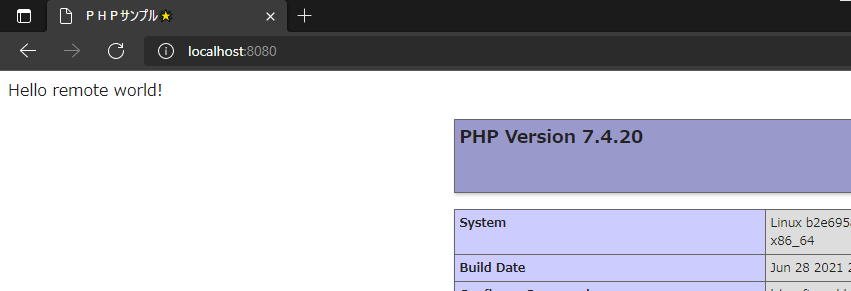
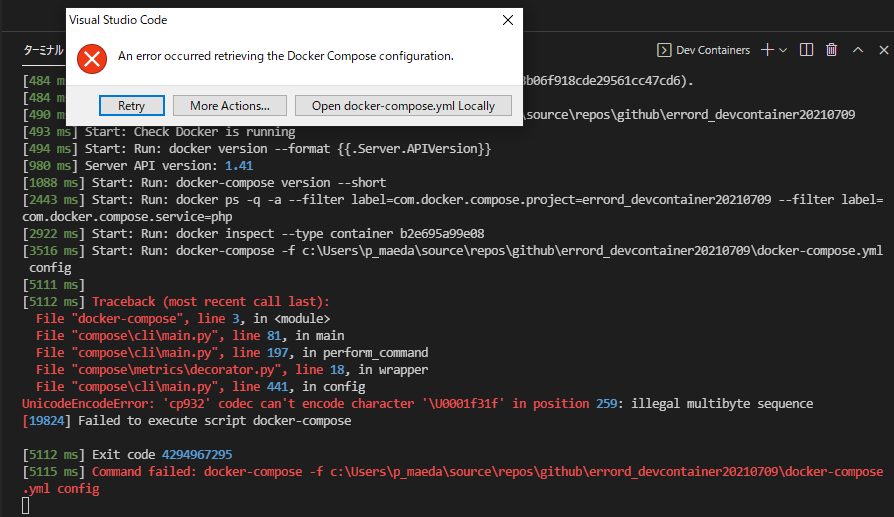

# errord_devcontainer20210709

vscode-remote-container error container pattern.

## OK pattern

* v0.183.0


## NG pattern

* v0.187.0


<details><summary>detail</summary>

```log
[2021-07-09T07:54:47.051Z] Remote-Containers 0.187.0 in VS Code 1.58.0 (2d23c42a936db1c7b3b06f918cde29561cc47cd6).
[2021-07-09T07:54:47.051Z] Start: Resolving Remote
[2021-07-09T07:54:47.055Z] Setting up container for folder or workspace: c:\Users\p_maeda\source\repos\github\errord_devcontainer20210709
[2021-07-09T07:54:47.057Z] Start: Check Docker is running
[2021-07-09T07:54:47.058Z] Start: Run: docker version --format {{.Server.APIVersion}}
[2021-07-09T07:54:47.641Z] Stop (583 ms): Run: docker version --format {{.Server.APIVersion}}
[2021-07-09T07:54:47.641Z] Server API version: 1.41
[2021-07-09T07:54:47.641Z] Stop (584 ms): Check Docker is running
[2021-07-09T07:54:47.758Z] Start: Run: docker-compose version --short
[2021-07-09T07:54:49.157Z] Stop (1399 ms): Run: docker-compose version --short
[2021-07-09T07:54:49.159Z] Start: Run: docker ps -q -a --filter label=com.docker.compose.project=errord_devcontainer20210709 --filter label=com.docker.compose.service=php
[2021-07-09T07:54:49.667Z] Stop (508 ms): Run: docker ps -q -a --filter label=com.docker.compose.project=errord_devcontainer20210709 --filter label=com.docker.compose.service=php
[2021-07-09T07:54:49.667Z] Start: Run: docker inspect --type container b2e695a99e08
[2021-07-09T07:54:50.232Z] Stop (565 ms): Run: docker inspect --type container b2e695a99e08
[2021-07-09T07:54:50.234Z] Start: Run: docker-compose -f c:\Users\p_maeda\source\repos\github\errord_devcontainer20210709\docker-compose.yml config
[2021-07-09T07:54:52.139Z] Stop (1905 ms): Run: docker-compose -f c:\Users\p_maeda\source\repos\github\errord_devcontainer20210709\docker-compose.yml config
[2021-07-09T07:54:52.140Z] 
[2021-07-09T07:54:52.140Z] Traceback (most recent call last):
  File "docker-compose", line 3, in <module>
  File "compose\cli\main.py", line 81, in main
  File "compose\cli\main.py", line 197, in perform_command
  File "compose\metrics\decorator.py", line 18, in wrapper
  File "compose\cli\main.py", line 441, in config
UnicodeEncodeError: 'cp932' codec can't encode character '\U0001f31f' in position 259: illegal multibyte sequence
[12900] Failed to execute script docker-compose

[2021-07-09T07:54:52.140Z] Exit code 4294967295
[2021-07-09T07:54:52.144Z] Command failed: docker-compose -f c:\Users\p_maeda\source\repos\github\errord_devcontainer20210709\docker-compose.yml config
```

</details>
