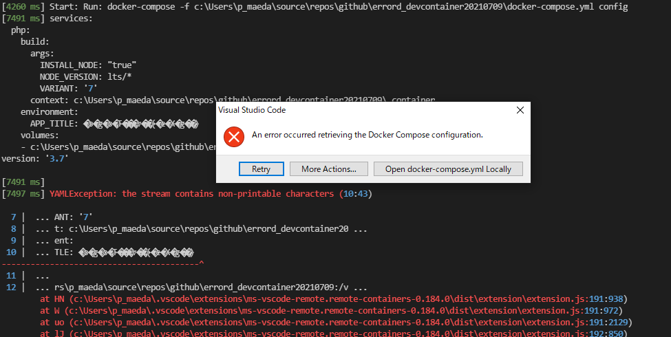

# errord_devcontainer20210721

vscode-remote-container error container pattern.

## OK pattern

* v0.183.0 \


<details><summary>logs</summary>

```log
[482 ms] Remote-Containers 0.183.0 in VS Code 1.58.2 (c3f126316369cd610563c75b1b1725e0679adfb3).
[481 ms] Start: Resolving Remote
[487 ms] Setting up container for folder or workspace: *****************************************\errord_devcontainer20210721
[490 ms] Start: Check Docker is running
[490 ms] Start: Run: docker version --format {{.Server.APIVersion}}
[1002 ms] Server API version: 1.41
[1160 ms] Start: Run: docker-compose version --short
[3432 ms] Start: Run: docker ps -q -a --filter label=com.docker.compose.project=errord_devcontainer20210721 --filter label=com.docker.compose.service=php
[4145 ms] Start: Run: docker-compose -f *****************************************\errord_devcontainer20210721\docker-compose.yml config --services
[5718 ms] php
[5719 ms] 
[5719 ms] Start: Run: docker events --format {{json .}} --filter event=start
[5746 ms] Start: Run: docker-compose --project-name errord_devcontainer20210721 -f *****************************************\errord_devcontainer20210721\docker-compose.yml up -d --build
Creating network "errord_devcontainer20210721_default" with the default driver
Building php
[+] Building 103.4s (6/6) FINISHED
 => [internal] load build definition from Dockerfile                                                                                                               1.6s
 => => transferring dockerfile: 900B                                                                                                                               0.0s
 => [internal] load .dockerignore                                                                                                                                  1.9s
 => => transferring context: 2B                                                                                                                                    0.0s
 => [internal] load metadata for mcr.microsoft.com/vscode/devcontainers/php:0-7                                                                                    3.0s
 => [1/2] FROM mcr.microsoft.com/vscode/devcontainers/php:0-7@sha256:b6f999ddc3796123d7eab757f1967c36948c8e26efe531cd723f80ab0243d5e4                             80.8s
 => => resolve mcr.microsoft.com/vscode/devcontainers/php:0-7@sha256:b6f999ddc3796123d7eab757f1967c36948c8e26efe531cd723f80ab0243d5e4                              0.2s
 => => sha256:b6f999ddc3796123d7eab757f1967c36948c8e26efe531cd723f80ab0243d5e4 4.29kB / 4.29kB                                                                     0.0s
 => => sha256:c1adfe52ef5acffd4ee406afe5c82c7380ba3c522657b53e7915fe4a63acea6a 18.84kB / 18.84kB                                                                   0.0s
 => => sha256:78b85dd8f01492a64ab518247894d5b93db91b5ef9c770b601b37f612278b602 228B / 228B                                                                         1.1s
 => => sha256:8589b26a90be6577309788924232d8900e0e44f0a7fb4ca01c32c6467578a27d 76.68MB / 76.68MB                                                                  29.5s
 => => sha256:f5af5d6419462987bdb2cd60de0729dcf0c35933ca87692f2eb9ca1ae292a642 270B / 270B                                                                         2.1s
 => => extracting sha256:78b85dd8f01492a64ab518247894d5b93db91b5ef9c770b601b37f612278b602                                                                          0.0s
 => => sha256:614ec6f0b8d6a562071e6a2584ca97b4237364aa3b78b00aa6c601a00c80d019 18.68MB / 18.68MB                                                                   6.1s
 => => sha256:12b28f3797fbefaacc6339a39139cd689c6038bdbe1ee96bd947d58397be3538 474B / 474B                                                                         3.2s
 => => sha256:96bcb7d2e6b049343069918b727a239aa0ae67500a2f20744af37dd6c89d90d9 515B / 515B                                                                         4.0s
 => => sha256:7aaa379b3e64ec978b15500be6afceea9013b530b98a0e73165358859be183e1 10.68MB / 10.68MB                                                                   9.3s
 => => sha256:20d533abc0d2def8c43e6d54b377a762c9dfb2e95481307ad5335e529b60d363 493B / 493B                                                                         6.7s
 => => sha256:073fc0e59151f4a4b744b265c027a4692219992cf959606ddbdf8b8227b71845 13.84MB / 13.84MB                                                                  10.9s
 => => sha256:eb495bf170975779cb3b386cfa951522c40a000f01d9f712718515b2c82e5234 2.28kB / 2.28kB                                                                    10.3s
 => => sha256:d1db301acce363d1945fd51dd6465dccf579067a73ee45c0f10db617595c800f 247B / 247B                                                                        11.1s
 => => sha256:5f57a05ed38e7b3edaa904c59d6cb54fd16fd499b472eee5b13f0edc2ffe868d 7.11kB / 7.11kB                                                                    12.0s
 => => sha256:5572477d34e8c54adc39ceafea9b09ebb961ef09f3de1035c33b8d33b7df7c0e 896B / 896B                                                                        12.5s
 => => sha256:36767b4c3c607097da5b13990ec4c97b9703181d5fec18052a21d814bd02337d 52.16MB / 52.16MB                                                                  22.9s
 => => sha256:09ea1ef96ed95149790eab5880a8596046616dfe270d56337a144d18aff2c506 1.10MB / 1.10MB                                                                    13.9s
 => => sha256:4a37ecad30c9550d2765ab97e64f825fc7ae614050461d4e89688794c07cec67 554.46kB / 554.46kB                                                                15.1s
 => => sha256:a6b26a4dc6a97113df65f292b7cc0221c5fc423da3a601ec1621b5c7c39188f9 1.90MB / 1.90MB                                                                    16.6s
 => => sha256:70607921841ba475272a2569319606066ac465e87214021c93e73c3279e4b1cd 138B / 138B                                                                        18.2s
 => => extracting sha256:8589b26a90be6577309788924232d8900e0e44f0a7fb4ca01c32c6467578a27d                                                                          4.0s
 => => extracting sha256:f5af5d6419462987bdb2cd60de0729dcf0c35933ca87692f2eb9ca1ae292a642                                                                          0.0s
 => => extracting sha256:614ec6f0b8d6a562071e6a2584ca97b4237364aa3b78b00aa6c601a00c80d019                                                                          0.8s
 => => extracting sha256:12b28f3797fbefaacc6339a39139cd689c6038bdbe1ee96bd947d58397be3538                                                                          0.0s
 => => extracting sha256:96bcb7d2e6b049343069918b727a239aa0ae67500a2f20744af37dd6c89d90d9                                                                          0.0s
 => => extracting sha256:7aaa379b3e64ec978b15500be6afceea9013b530b98a0e73165358859be183e1                                                                          0.1s
 => => extracting sha256:20d533abc0d2def8c43e6d54b377a762c9dfb2e95481307ad5335e529b60d363                                                                          0.0s
 => => extracting sha256:073fc0e59151f4a4b744b265c027a4692219992cf959606ddbdf8b8227b71845                                                                          0.8s
 => => extracting sha256:eb495bf170975779cb3b386cfa951522c40a000f01d9f712718515b2c82e5234                                                                          0.0s
 => => extracting sha256:d1db301acce363d1945fd51dd6465dccf579067a73ee45c0f10db617595c800f                                                                          0.0s
 => => extracting sha256:5572477d34e8c54adc39ceafea9b09ebb961ef09f3de1035c33b8d33b7df7c0e                                                                          0.0s
 => => extracting sha256:5f57a05ed38e7b3edaa904c59d6cb54fd16fd499b472eee5b13f0edc2ffe868d                                                                          0.0s
 => => extracting sha256:36767b4c3c607097da5b13990ec4c97b9703181d5fec18052a21d814bd02337d                                                                          2.9s
 => => extracting sha256:09ea1ef96ed95149790eab5880a8596046616dfe270d56337a144d18aff2c506                                                                          0.1s
 => => extracting sha256:4a37ecad30c9550d2765ab97e64f825fc7ae614050461d4e89688794c07cec67                                                                          0.1s
 => => extracting sha256:a6b26a4dc6a97113df65f292b7cc0221c5fc423da3a601ec1621b5c7c39188f9                                                                          0.2s
 => => extracting sha256:70607921841ba475272a2569319606066ac465e87214021c93e73c3279e4b1cd                                                                          0.0s
 => [2/2] RUN if [ "true" = "true" ]; then su vscode -c "umask 0002 && . /usr/local/share/nvm/nvm.sh && nvm install lts/* 2>&1"; fi                               12.8s
 => exporting to image                                                                                                                                             3.8s
 => => exporting layers                                                                                                                                            2.4s
 => => writing image sha256:39889dc532f36029e31bf3b43c4af90ee8eafe7d7194620cd46534314be48710                                                                       0.1s
 => => naming to docker.io/library/errord_devcontainer20210721_php                                                                                                 0.1s

Use 'docker scan' to run Snyk tests against images to find vulnerabilities and learn how to fix them
Creating errord_devcontainer20210721_php_1 ... done
[122726 ms] Start: Run: docker ps -q -a --filter label=com.docker.compose.project=errord_devcontainer20210721 --filter label=com.docker.compose.service=php
[123590 ms] Start: Run: docker inspect --type container 2785c53a149d
[124220 ms] Start: Inspecting container
[124220 ms] Start: Run: docker inspect --type container 2785c53a149d932aaf4d7745542c4dd0323307ead3b87d894d95ed7ce155a8b8
[124805 ms] Start: Run in container: /bin/sh
[124834 ms] Start: Run in container: uname -m
[125784 ms] x86_64
[125785 ms] 
[125785 ms] Start: Run in container: (cat /etc/os-release || cat /usr/lib/os-release) 2>/dev/null
[125788 ms] PRETTY_NAME="Debian GNU/Linux 10 (buster)"
NAME="Debian GNU/Linux"
VERSION_ID="10"
VERSION="10 (buster)"
VERSION_CODENAME=buster
ID=debian
HOME_URL="https://www.debian.org/"
SUPPORT_URL="https://www.debian.org/support"
BUG_REPORT_URL="https://bugs.debian.org/"
[125788 ms] 
[125788 ms] Start: Run in container: cat /etc/passwd
[125793 ms] Start: Updating configuration state
[125877 ms] Start: Setup shutdown monitor
[125878 ms] Forking shutdown monitor: *******************\.vscode\extensions\ms-vscode-remote.remote-containers-0.183.0\dist\shutdown\shutdownMonitorProcess \\.\pipe\vscode-remote-containers-bdf7aed3a3ab8c299bab642fd8c7c53dd5938dce-sock dockerCompose Debug *******************\AppData\Roaming\Code\logs\20210721T094800\exthost3\ms-vscode-remote.remote-containers 1626829790121
[125893 ms] Start: Run in container: test -d /home/vscode/.vscode-server
[125897 ms] 
[125897 ms] 
[125897 ms] Exit code 1
[125897 ms] Start: Run in container: test -d /home/vscode/.vscode-remote
[125902 ms] 
[125903 ms] 
[125903 ms] Exit code 1
[125903 ms] Start: Run in container: test -f /var/vscode-server/.patchEtcEnvironmentMarker
[125906 ms] 
[125906 ms] 
[125906 ms] Exit code 1
[125906 ms] Start: Run in container: /bin/sh
[125933 ms] Start: Run in container: set -o noclobber ; mkdir -p '/var/vscode-server' && { > '/var/vscode-server/.patchEtcEnvironmentMarker' ; } 2> /dev/null
[127266 ms] 
[127266 ms] 
[127266 ms] Start: Run in container: cat >> /etc/environment <<'etcEnvrionmentEOF'
[127269 ms] 
[127269 ms] 
[127270 ms] Start: Run in container: test -f /var/vscode-server/.patchEtcProfileMarker
[127272 ms] 
[127272 ms] 
[127272 ms] Exit code 1
[127272 ms] Start: Run in container: set -o noclobber ; mkdir -p '/var/vscode-server' && { > '/var/vscode-server/.patchEtcProfileMarker' ; } 2> /dev/null
[127276 ms] 
[127276 ms] 
[127276 ms] Start: Run in container: sed -i -E 's/((^|\s)PATH=)([^\$]*)$/\1${PATH:-\3}/g' /etc/profile || true
[127279 ms] 
[127280 ms] 
[127280 ms] Start: Run in container: set -o noclobber ; mkdir -p '/home/vscode/.vscode-server/data/Machine' && { > '/home/vscode/.vscode-server/data/Machine/.writeMachineSettingsMarker' ; } 2> /dev/null
[127283 ms] 
[127283 ms] 
[127284 ms] Start: Run in container: mkdir -p '/home/vscode/.vscode-server/data/Machine' && cat >'/home/vscode/.vscode-server/data/Machine/settings.json' <<'settingsJSON'
[127287 ms] 
[127288 ms] 
[127288 ms] Start: Run in container: test -d /home/vscode/.vscode-server/bin/c3f126316369cd610563c75b1b1725e0679adfb3
[127292 ms] 
[127292 ms] 
[127292 ms] Exit code 1
[127293 ms] Installing VS Code Server for commit c3f126316369cd610563c75b1b1725e0679adfb3
[127457 ms] Start: Installing VS Code Server
[127457 ms] Start: Run in container: mkdir -p /home/vscode/.vscode-server/bin/c3f126316369cd610563c75b1b1725e0679adfb3_1626829917578
[127466 ms] 
[127466 ms] 
[129928 ms] Start: Run in container: (dd iflag=fullblock bs=8192 count=5708 2>/dev/null; dd iflag=fullblock bs=3222 count=1 2>/dev/null) | tar --no-same-owner -xz --strip-components 1 -C /home/vscode/.vscode-server/bin/c3f126316369cd610563c75b1b1725e0679adfb3_1626829917578
[132094 ms] 
[132094 ms] 
[132094 ms] Start: Run in container: mv -n /home/vscode/.vscode-server/bin/c3f126316369cd610563c75b1b1725e0679adfb3_1626829917578 /home/vscode/.vscode-server/bin/c3f126316369cd610563c75b1b1725e0679adfb3
[132098 ms] 
[132098 ms] 
[132099 ms] Start: Launching Remote-Containers helper.
[132100 ms] Start: Run: gpgconf --list-dir agent-extra-socket
[132134 ms] findLocalWindowsExecutable: Exectuable 'gpgconf' not found on PATH 'C:\WINDOWS\system32;C:\WINDOWS;C:\WINDOWS\System32\Wbem;C:\WINDOWS\System32\WindowsPowerShell\v1.0\;C:\WINDOWS\System32\OpenSSH\;C:\Program Files\dotnet\;C:\Program Files\TortoiseGit\bin;C:\Program Files\Microsoft SQL Server\130\Tools\Binn\;C:\Program Files\Microsoft SQL Server\Client SDK\ODBC\170\Tools\Binn\;C:\Program Files (x86)\Windows Kits\10\Windows Performance Toolkit\;C:\Program Files\Git\cmd;C:\Program Files\PowerShell\7-preview\preview;C:\Program Files\Docker\Docker\resources\bin;C:\ProgramData\DockerDesktop\version-bin;C:\Program Files (x86)\dotnet\;C:\Program Files\nodejs\;*******************\AppData\Local\Microsoft\WindowsApps;;*******************\AppData\Local\Programs\Microsoft VS Code\bin;*******************\.dotnet\tools;*******************\AppData\Roaming\npm;*******************\AppData\Local\Programs\Microsoft VS Code Insiders\bin'.
[132138 ms] userEnvProbe: loginInteractiveShell (default)
[132139 ms] userEnvProbe shell: /bin/bash
[132140 ms] Start: Run in container: command -v git >/dev/null 2>&1 && git config --system credential.helper '!f() { /home/vscode/.vscode-server/bin/c3f126316369cd610563c75b1b1725e0679adfb3/node /tmp/vscode-remote-containers-6ce14c14185079e9943a95c3a70519b4a79eddcf.js $*; }; f' || true
[132150 ms] Start: Run in container: cat <<'EOF-/tmp/vscode-remote-containers-6ce14c14185079e9943a95c3a70519b4a79eddcf.js' >/tmp/vscode-remote-containers-6ce14c14185079e9943a95c3a70519b4a79eddcf.js
[132163 ms] 
[132164 ms] 
[132186 ms] Start: Run in container: cat <<'EOF-/tmp/vscode-remote-containers-server-6ce14c14185079e9943a95c3a70519b4a79eddcf.js' >/tmp/vscode-remote-containers-server-6ce14c14185079e9943a95c3a70519b4a79eddcf.js
[132189 ms] 
[132190 ms] 
[132190 ms] Start: Run in container: /home/vscode/.vscode-server/bin/c3f126316369cd610563c75b1b1725e0679adfb3/node /tmp/vscode-remote-containers-server-6ce14c14185079e9943a95c3a70519b4a79eddcf.js
[132194 ms] 
[132194 ms] 
[132194 ms] Start: Preparing Extensions
[132195 ms] Start: Run in container: set -o noclobber ; mkdir -p '/home/vscode/.vscode-server/data/Machine' && { > '/home/vscode/.vscode-server/data/Machine/.installExtensionsMarker' ; } 2> /dev/null
[132199 ms] 
[132199 ms] 
[132202 ms] Extensions cache, install extensions: felixfbecker.php-debug, bmewburn.vscode-intelephense-client, mrmlnc.vscode-apache, MS-CEINTL.vscode-language-pack-ja
[132202 ms] Start: Run in container: test -d /home/vscode/.vscode-server/extensionsCache && ls /home/vscode/.vscode-server/extensionsCache || true
[132213 ms] 
[132213 ms] 
[132259 ms] Extensions cache, copy to remote: bmewburn.vscode-intelephense-client-1.7.1, felixfbecker.php-debug-1.16.1, mrmlnc.vscode-apache-1.2.0, ms-ceintl.vscode-language-pack-ja-1.58.8
[132613 ms] Start: Run in container: # Copy extensions to remote
[132751 ms] 
[132751 ms] 
[132752 ms] Start: Run in container: for pid in `cd /proc && ls -d [0-9]*`; do { echo $pid ; readlink /proc/$pid/cwd ; readlink /proc/$pid/ns/mnt ; cat /proc/$pid/stat | tr "
[132850 ms] Start: Starting VS Code Server
[132850 ms] Start: Run in container: /home/vscode/.vscode-server/bin/c3f126316369cd610563c75b1b1725e0679adfb3/server.sh --log debug --force-disable-user-env --use-host-proxy --port 0 --extensions-download-dir /home/vscode/.vscode-server/extensionsCache --install-extension felixfbecker.php-debug --install-extension bmewburn.vscode-intelephense-client --install-extension mrmlnc.vscode-apache --install-extension MS-CEINTL.vscode-language-pack-ja --start-server
[133533 ms] 

*
* Visual Studio Code Server
*
* Reminder: You may only use this software with Visual Studio family products,
* as described in the license https://aka.ms/vscode-remote/license
*

Extension host agent listening on 39653

[133534 ms] Start: Run in container: echo 39653 >/home/vscode/.vscode-server/data/Machine/.devport
[133536 ms] 
[133537 ms] 
[133537 ms] Port forwarding for container port 39653 starts listening on local port.
[133539 ms] Port forwarding local port 39653 to container port 39653
[133590 ms] Start: Run in container: set -o noclobber ; mkdir -p '/home/vscode/.vscode-server/data/Machine' && { > '/home/vscode/.vscode-server/data/Machine/.onCreateCommandMarker' ; } 2> /dev/null
[133611 ms] 
[133611 ms] 
[133611 ms] Start: Run in container: set -o noclobber ; mkdir -p '/home/vscode/.vscode-server/data/Machine' && { > '/home/vscode/.vscode-server/data/Machine/.updateContentCommandMarker' ; } 2> /dev/null
[133617 ms] 
[133617 ms] 
[133618 ms] Start: Run in container: set -o noclobber ; mkdir -p '/home/vscode/.vscode-server/data/Machine' && { > '/home/vscode/.vscode-server/data/Machine/.postCreateCommandMarker' ; } 2> /dev/null
[133630 ms] 
[133630 ms] 
[133631 ms] Start: Run in container: # Test for /home/vscode/.gitconfig and git
[133652 ms] 
[133652 ms] 
[133652 ms] Start: Run in container: # Copy *******************\.gitconfig to /home/vscode/.gitconfig
[133670 ms] 
[133670 ms] 
[133671 ms] Start: Run in container: command -v git >/dev/null 2>&1 && git config --global credential.helper '!f() { /home/vscode/.vscode-server/bin/c3f126316369cd610563c75b1b1725e0679adfb3/node /tmp/vscode-remote-containers-6ce14c14185079e9943a95c3a70519b4a79eddcf.js $*; }; f' || true
[133735 ms] 
[133735 ms] 
[133736 ms] Start: Run in container: mkdir -p '/home/vscode/.vscode-server/data/Machine' && [ "$(cat '/home/vscode/.vscode-server/data/Machine/.postStartCommandMarker' 2>/dev/null)" != '2021-07-21T01:11:52.3269135Z' ] && echo '2021-07-21T01:11:52.3269135Z' > '/home/vscode/.vscode-server/data/Machine/.postStartCommandMarker'
[133772 ms] 
[133773 ms] 
[133787 ms] userEnvProbe PATHs:
Probe:     '/usr/local/share/nvm/current/bin:/usr/local/share/nvm/versions/node/v14.17.3/bin:/usr/local/sbin:/usr/local/bin:/usr/sbin:/usr/bin:/sbin:/bin:/home/vscode/.local/bin'
Container: '/usr/local/share/nvm/current/bin:/usr/local/sbin:/usr/local/bin:/usr/sbin:/usr/bin:/sbin:/bin'
[133797 ms] [01:12:03] Extension host agent started.
[133834 ms] Installing extensions...
[134447 ms] Port forwarding connection from 62634 > 39653 > 39653 in the container.
[134447 ms] Start: Run in container: /home/vscode/.vscode-server/bin/c3f126316369cd610563c75b1b1725e0679adfb3/node -e 
[134647 ms] Installing extension 'felixfbecker.php-debug'...
[134681 ms] Installing extension 'bmewburn.vscode-intelephense-client'...
[134712 ms] Installing extension 'ms-ceintl.vscode-language-pack-ja'...
[134801 ms] Installing extension 'mrmlnc.vscode-apache'...
[134802 ms] [01:12:04] Installing extension: felixfbecker.php-debug
[134802 ms] [01:12:04] Installing extension: bmewburn.vscode-intelephense-client
[01:12:04] Installing extension: mrmlnc.vscode-apache
[135311 ms] [01:12:05] Installing extension: ms-ceintl.vscode-language-pack-ja
[135494 ms] [01:12:05] Downloaded extension: felixfbecker.php-debug /home/vscode/.vscode-server/extensionsCache/felixfbecker.php-debug-1.16.1
[135531 ms] [01:12:05] Downloaded extension: mrmlnc.vscode-apache /home/vscode/.vscode-server/extensionsCache/mrmlnc.vscode-apache-1.2.0
[135581 ms] [01:12:05] Downloaded extension: bmewburn.vscode-intelephense-client /home/vscode/.vscode-server/extensionsCache/bmewburn.vscode-intelephense-client-1.7.1
[135730 ms] Port forwarding connection from 62648 > 39653 > 39653 in the container.
[135730 ms] Start: Run in container: /home/vscode/.vscode-server/bin/c3f126316369cd610563c75b1b1725e0679adfb3/node -e 
[135733 ms] [01:12:05] Downloaded extension: ms-ceintl.vscode-language-pack-ja /home/vscode/.vscode-server/extensionsCache/ms-ceintl.vscode-language-pack-ja-1.58.8
[135799 ms] [01:12:05] Extracted extension to /home/vscode/.vscode-server/extensions/.0ae9d8fc-e840-430f-a9d1-1541c3c0df4b: mrmlnc.vscode-apache
[135971 ms] [01:12:05] Renamed to /home/vscode/.vscode-server/extensions/mrmlnc.vscode-apache-1.2.0
[135986 ms] [01:12:05] Installation completed. mrmlnc.vscode-apache
[136099 ms] [01:12:06] Extensions installed successfully: mrmlnc.vscode-apache
[136100 ms] Extension 'mrmlnc.vscode-apache' v1.2.0 was successfully installed.
[136286 ms] [01:12:06] [::ffff:127.0.0.1][2c1e124f][ManagementConnection] New connection established.
[136885 ms] [01:12:06] [::ffff:127.0.0.1][e555fca6][ExtensionHostConnection] New connection established.
[136904 ms] [01:12:06] [::ffff:127.0.0.1][e555fca6][ExtensionHostConnection] <409> Launched Extension Host Process.
[137948 ms] [01:12:07] Extracted extension to /home/vscode/.vscode-server/extensions/.fe7641cf-d409-4b05-8f2a-8e0689a80054: ms-ceintl.vscode-language-pack-ja
[138874 ms] [01:12:08] Renamed to /home/vscode/.vscode-server/extensions/ms-ceintl.vscode-language-pack-ja-1.58.8
[138903 ms] [01:12:08] Installation completed. ms-ceintl.vscode-language-pack-ja
[140033 ms] [01:12:10] Extensions installed successfully: ms-ceintl.vscode-language-pack-ja
[140055 ms] Extension 'ms-ceintl.vscode-language-pack-ja' v1.59.0 was successfully installed.
[140366 ms] [01:12:10] Extracted extension to /home/vscode/.vscode-server/extensions/.d877d790-c4f4-4eb5-9f62-943f81764e73: bmewburn.vscode-intelephense-client
[141079 ms] [01:12:11] Extracted extension to /home/vscode/.vscode-server/extensions/.f7172e06-d83b-4af0-bf42-c0805a7e3089: felixfbecker.php-debug
[141738 ms] [01:12:11] Renamed to /home/vscode/.vscode-server/extensions/bmewburn.vscode-intelephense-client-1.7.1
[01:12:11] Installation completed. bmewburn.vscode-intelephense-client
[142095 ms] [01:12:12] Renamed to /home/vscode/.vscode-server/extensions/felixfbecker.php-debug-1.16.1
[142097 ms] [01:12:12] Installation completed. felixfbecker.php-debug
[142401 ms] [01:12:12] Extensions installed successfully: bmewburn.vscode-intelephense-client
[142458 ms] Extension 'bmewburn.vscode-intelephense-client' v1.7.1 was successfully installed.
[142682 ms] [01:12:12] Extensions installed successfully: felixfbecker.php-debug
[142684 ms] Extension 'felixfbecker.php-debug' v1.16.1 was successfully installed.
[142755 ms] Extensions cache, remote removals: None
```

</details>


## NG pattern

<details><summary>v0.184.0</summary>



```log
[2021-07-21T01:05:56.492Z] Remote-Containers 0.184.0 in VS Code 1.58.2 (c3f126316369cd610563c75b1b1725e0679adfb3).
[2021-07-21T01:05:56.492Z] Start: Resolving Remote
[2021-07-21T01:05:56.503Z] Setting up container for folder or workspace: *****************************************\errord_devcontainer20210721
[2021-07-21T01:05:56.506Z] Start: Check Docker is running
[2021-07-21T01:05:56.506Z] Start: Run: docker version --format {{.Server.APIVersion}}
[2021-07-21T01:05:57.044Z] Stop (538 ms): Run: docker version --format {{.Server.APIVersion}}
[2021-07-21T01:05:57.045Z] Server API version: 1.41
[2021-07-21T01:05:57.045Z] Stop (539 ms): Check Docker is running
[2021-07-21T01:05:57.149Z] Start: Run: docker-compose version --short
[2021-07-21T01:05:59.654Z] Stop (2505 ms): Run: docker-compose version --short
[2021-07-21T01:05:59.656Z] Start: Run: docker ps -q -a --filter label=com.docker.compose.project=errord_devcontainer20210721 --filter label=com.docker.compose.service=php
[2021-07-21T01:06:00.239Z] Stop (583 ms): Run: docker ps -q -a --filter label=com.docker.compose.project=errord_devcontainer20210721 --filter label=com.docker.compose.service=php
[2021-07-21T01:06:00.240Z] Start: Run: docker-compose -f *****************************************\errord_devcontainer20210721\docker-compose.yml config
[2021-07-21T01:06:03.470Z] Stop (3230 ms): Run: docker-compose -f *****************************************\errord_devcontainer20210721\docker-compose.yml config
[2021-07-21T01:06:03.471Z] services:
  php:
    build:
      args:
        INSTALL_NODE: "true"
        NODE_VERSION: lts/*
        VARIANT: '7'
      context: *****************************************\errord_devcontainer20210721\.container
    environment:
      APP_TITLE: �o�g�o�T���v��(�e�X�g�‹�)
    volumes:
    - *****************************************\errord_devcontainer20210721:/var/www/html:rw
version: '3.7'

[2021-07-21T01:06:03.471Z] 
[2021-07-21T01:06:03.477Z] YAMLException: the stream contains non-printable characters (10:43)

  7 |  ... ANT: '7'
  8 |  ... t: *****************************************\errord_devcontainer20 ...
  9 |  ... ent:
 10 |  ... TLE: �o�g�o�T���v��(�e�X�g�‹�)
-----------------------------------------^
 11 |  ... 
 12 |  ... ***********************************\errord_devcontainer20210721:/v ...
	at HN (*******************\.vscode\extensions\ms-vscode-remote.remote-containers-0.184.0\dist\extension\extension.js:191:938)
	at W (*******************\.vscode\extensions\ms-vscode-remote.remote-containers-0.184.0\dist\extension\extension.js:191:972)
	at uo (*******************\.vscode\extensions\ms-vscode-remote.remote-containers-0.184.0\dist\extension\extension.js:191:2129)
	at lJ (*******************\.vscode\extensions\ms-vscode-remote.remote-containers-0.184.0\dist\extension\extension.js:192:850)
	at rc (*******************\.vscode\extensions\ms-vscode-remote.remote-containers-0.184.0\dist\extension\extension.js:198:5028)
	at mJ (*******************\.vscode\extensions\ms-vscode-remote.remote-containers-0.184.0\dist\extension\extension.js:198:2150)
	at rc (*******************\.vscode\extensions\ms-vscode-remote.remote-containers-0.184.0\dist\extension\extension.js:198:4873)
	at mJ (*******************\.vscode\extensions\ms-vscode-remote.remote-containers-0.184.0\dist\extension\extension.js:198:2150)
	at rc (*******************\.vscode\extensions\ms-vscode-remote.remote-containers-0.184.0\dist\extension\extension.js:198:4873)
	at mJ (*******************\.vscode\extensions\ms-vscode-remote.remote-containers-0.184.0\dist\extension\extension.js:198:2150)
	at rc (*******************\.vscode\extensions\ms-vscode-remote.remote-containers-0.184.0\dist\extension\extension.js:198:4873)
	at mJ (*******************\.vscode\extensions\ms-vscode-remote.remote-containers-0.184.0\dist\extension\extension.js:198:2150)
	at rc (*******************\.vscode\extensions\ms-vscode-remote.remote-containers-0.184.0\dist\extension\extension.js:198:4873)
	at CJ (*******************\.vscode\extensions\ms-vscode-remote.remote-containers-0.184.0\dist\extension\extension.js:198:7250)
	at WN (*******************\.vscode\extensions\ms-vscode-remote.remote-containers-0.184.0\dist\extension\extension.js:199:258)
	at EJ (*******************\.vscode\extensions\ms-vscode-remote.remote-containers-0.184.0\dist\extension\extension.js:199:478)
	at Fte (*******************\.vscode\extensions\ms-vscode-remote.remote-containers-0.184.0\dist\extension\extension.js:238:2086)
	at processTicksAndRejections (internal/process/task_queues.js:93:5)
	at async VF (*******************\.vscode\extensions\ms-vscode-remote.remote-containers-0.184.0\dist\extension\extension.js:238:449)
	at async hZ (*******************\.vscode\extensions\ms-vscode-remote.remote-containers-0.184.0\dist\extension\extension.js:218:10180)


```

</details>

<details><summary>v0.187.1</summary>

 "NG Image")

```log
[2021-07-21T00:59:39.821Z] Remote-Containers 0.187.1 in VS Code 1.58.2 (c3f126316369cd610563c75b1b1725e0679adfb3).
[2021-07-21T00:59:39.821Z] Start: Resolving Remote
[2021-07-21T00:59:39.825Z] Setting up container for folder or workspace: *****************************************\errord_devcontainer20210721
[2021-07-21T00:59:39.828Z] Start: Check Docker is running
[2021-07-21T00:59:39.829Z] Start: Run: docker version --format {{.Server.APIVersion}}
[2021-07-21T00:59:40.386Z] Stop (557 ms): Run: docker version --format {{.Server.APIVersion}}
[2021-07-21T00:59:40.386Z] Server API version: 1.41
[2021-07-21T00:59:40.386Z] Stop (558 ms): Check Docker is running
[2021-07-21T00:59:40.502Z] Start: Run: docker-compose version --short
[2021-07-21T00:59:43.399Z] Stop (2897 ms): Run: docker-compose version --short
[2021-07-21T00:59:43.400Z] Start: Run: docker ps -q -a --filter label=com.docker.compose.project=errord_devcontainer20210721 --filter label=com.docker.compose.service=php
[2021-07-21T00:59:44.356Z] Stop (956 ms): Run: docker ps -q -a --filter label=com.docker.compose.project=errord_devcontainer20210721 --filter label=com.docker.compose.service=php
[2021-07-21T00:59:44.357Z] Start: Run: docker-compose -f *****************************************\errord_devcontainer20210721\docker-compose.yml config
[2021-07-21T00:59:46.155Z] Stop (1798 ms): Run: docker-compose -f *****************************************\errord_devcontainer20210721\docker-compose.yml config
[2021-07-21T00:59:46.155Z] services:
  php:
    build:
      args:
        INSTALL_NODE: "true"
        NODE_VERSION: lts/*
        VARIANT: '7'
      context: *****************************************\errord_devcontainer20210721\.container
    environment:
      APP_TITLE: �o�g�o�T���v��(�e�X�g�‹�)
    volumes:
    - *****************************************\errord_devcontainer20210721:/var/www/html:rw
version: '3.7'

[2021-07-21T00:59:46.156Z] 
[2021-07-21T00:59:46.163Z] YAMLException: the stream contains non-printable characters (10:43)

  7 |  ... ANT: '7'
  8 |  ... t: *****************************************\errord_devcontainer20 ...
  9 |  ... ent:
 10 |  ... TLE: �o�g�o�T���v��(�e�X�g�‹�)
-----------------------------------------^
 11 |  ... 
 12 |  ... ***********************************\errord_devcontainer20210721:/v ...
	at zN (*******************\.vscode\extensions\ms-vscode-remote.remote-containers-0.187.1\dist\extension\extension.js:193:938)
	at z (*******************\.vscode\extensions\ms-vscode-remote.remote-containers-0.187.1\dist\extension\extension.js:193:972)
	at lo (*******************\.vscode\extensions\ms-vscode-remote.remote-containers-0.187.1\dist\extension\extension.js:193:2129)
	at mJ (*******************\.vscode\extensions\ms-vscode-remote.remote-containers-0.187.1\dist\extension\extension.js:194:850)
	at nc (*******************\.vscode\extensions\ms-vscode-remote.remote-containers-0.187.1\dist\extension\extension.js:200:5028)
	at wJ (*******************\.vscode\extensions\ms-vscode-remote.remote-containers-0.187.1\dist\extension\extension.js:200:2150)
	at nc (*******************\.vscode\extensions\ms-vscode-remote.remote-containers-0.187.1\dist\extension\extension.js:200:4873)
	at wJ (*******************\.vscode\extensions\ms-vscode-remote.remote-containers-0.187.1\dist\extension\extension.js:200:2150)
	at nc (*******************\.vscode\extensions\ms-vscode-remote.remote-containers-0.187.1\dist\extension\extension.js:200:4873)
	at wJ (*******************\.vscode\extensions\ms-vscode-remote.remote-containers-0.187.1\dist\extension\extension.js:200:2150)
	at nc (*******************\.vscode\extensions\ms-vscode-remote.remote-containers-0.187.1\dist\extension\extension.js:200:4873)
	at wJ (*******************\.vscode\extensions\ms-vscode-remote.remote-containers-0.187.1\dist\extension\extension.js:200:2150)
	at nc (*******************\.vscode\extensions\ms-vscode-remote.remote-containers-0.187.1\dist\extension\extension.js:200:4873)
	at bJ (*******************\.vscode\extensions\ms-vscode-remote.remote-containers-0.187.1\dist\extension\extension.js:200:7250)
	at QN (*******************\.vscode\extensions\ms-vscode-remote.remote-containers-0.187.1\dist\extension\extension.js:201:258)
	at PJ (*******************\.vscode\extensions\ms-vscode-remote.remote-containers-0.187.1\dist\extension\extension.js:201:478)
	at bte (*******************\.vscode\extensions\ms-vscode-remote.remote-containers-0.187.1\dist\extension\extension.js:246:825)
	at processTicksAndRejections (internal/process/task_queues.js:93:5)
	at async _te (*******************\.vscode\extensions\ms-vscode-remote.remote-containers-0.187.1\dist\extension\extension.js:234:1997)
	at async LF (*******************\.vscode\extensions\ms-vscode-remote.remote-containers-0.187.1\dist\extension\extension.js:234:455)
	at async Dte (*******************\.vscode\extensions\ms-vscode-remote.remote-containers-0.187.1\dist\extension\extension.js:246:10734)

```

</details>
